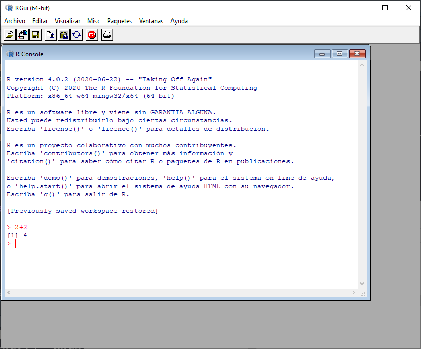
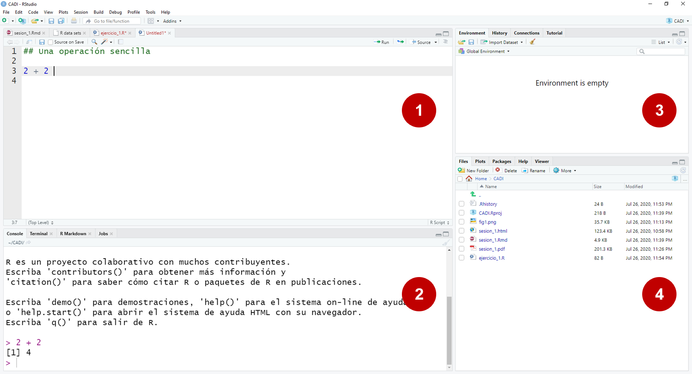
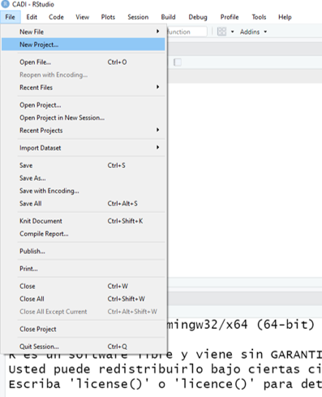
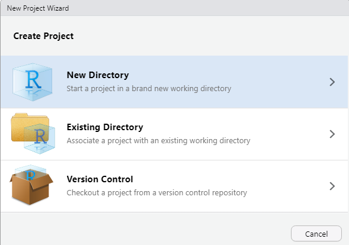
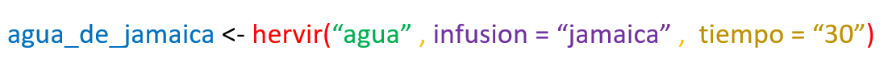
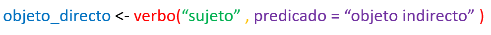
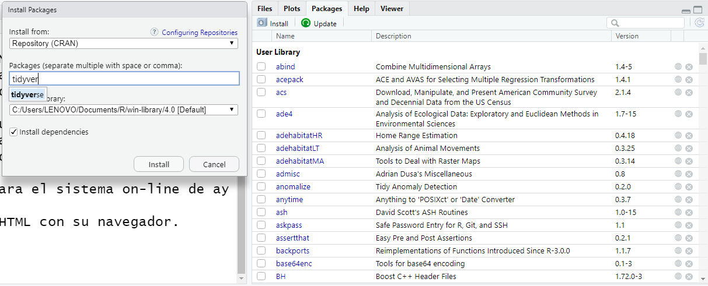
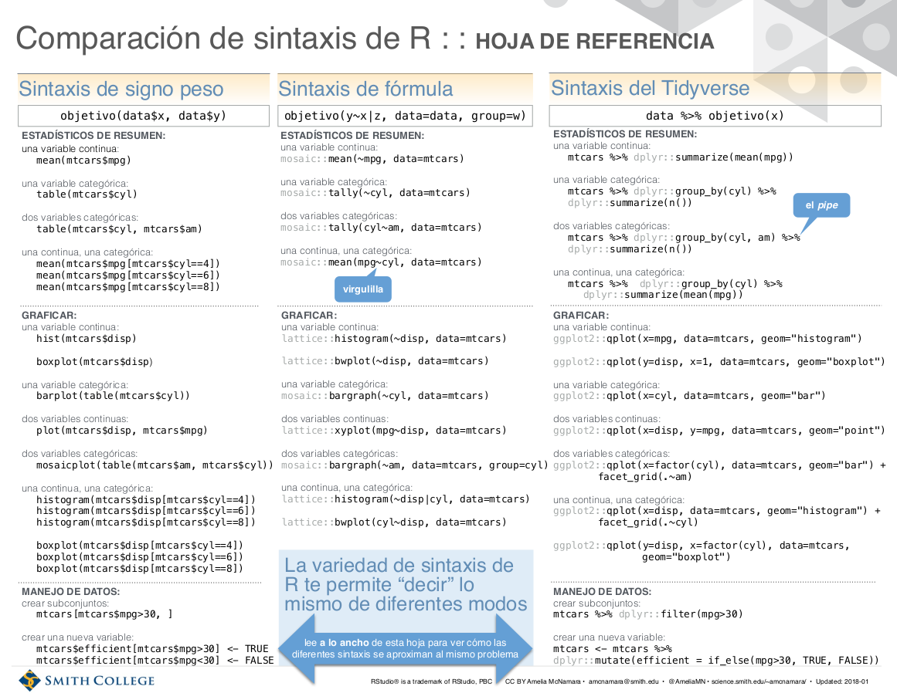

```{r setup, include=FALSE}
knitr::opts_chunk$set(echo = FALSE)
```


## ¡Hola mundo!

Esta es la primera sesión del curso introductorio de `R` para el personal del IMCO. Muchas gracias por inscribirse y ojalá sea de utilidad.

**Primero lo primero**: ¿Ya tienes `R` y *R Studio* instalado en tu computadora? Si has tenido problemas, prueba con las instrucciones gráficas de este sitio: [https://r-coder.com/instalar-r/](https://r-coder.com/instalar-r/).

## ¿Qué es R?

R es un entorno y lenguaje de programación con un enfoque al análisis estadístico desarrollado inicialmente por *R*obert Gentleman y *R*oss Ihaka del Departamento de Estadística de la Universidad de Auckland en 1993.

R es un lenguaje libre en un entorno colaborativo y abierto.


## La estructura

Serán 4 días intensivos de 4 horas (*fiuf*!).

Para hacernos un poco más ligero estas sesiones, propongo la siguiente estructura de tiempo.

- 1:30 horas de exposición (9 a 10:30 am)

- 20 minutos de descanso

- 1:30 horas de exposición (11:00 am a 2 pm)


## Los objetivos

Mis objetivos en este son los 3, en ese orden:

1. Que la persona pueda producir un *producto* basado en un análisis de datos. 
    - Este producto debe ser resultado de un *flujo de trabajo* exitoso basado en la importación, tratamiento, análisis y comunicación de hallazgos.

2. Que la persona logre encontrar la información necesaria para resolver sus *necesidades* de análisis de datos.

3. Que la persona entienda la sintaxis general del lenguaje `R` y del `tidyverse` como sintaxis complementaria.


## La habilidad más importante: preguntar

Dónde y cómo preguntar es quizás la habilidad más importante de este curso. Hay miles de sitios en internet que pueden ofrecernos una solución, aunque usualmente podremos encontrar la mayor parte de nuestras preguntas se encontrará en alguno de los sitios más importantes.

Algunas de las fuentes más confiables para encontrar respuestas:

- Stack Overflow [https://stackoverflow.com/](https://stackoverflow.com/)
- Statistical tools for high-throughput data analysis [http://www.sthda.com/english/](http://www.sthda.com/english/)
- R bloggers [https://www.r-bloggers.com/tag/rblogs/](https://www.r-bloggers.com/tag/rblogs/)

## La habilidad más importante: preguntar

Seguro te preguntaras: ¿por qué preguntar es la habilidad más importante?

La respuesta más sencilla es porque ya alguien más preguntó lo que me estoy preguntando.

- *¿Cómo sumo dos columnas en `R`?* [https://stackoverflow.com/questions/26046776/sum-two-columns-in-r](https://stackoverflow.com/questions/26046776/sum-two-columns-in-r)
- *¿Cómo hago una suma por grupos en `R`* [https://stackoverflow.com/questions/1660124/how-to-sum-a-variable-by-group](https://stackoverflow.com/questions/1660124/how-to-sum-a-variable-by-group)
- *¿Cómo implemento una red neuronal en `R`?* [https://stackoverflow.com/questions/48081506/r-neural-networks](https://stackoverflow.com/questions/48081506/r-neural-networks)


## La segunda habilidad más importante: aceptar la frustración

En estos tres ejemplos no está directamente la respuesta, sino la forma de *solucionar un error*. Y es que, para quien empieza, este es el primer aprendizaje: **nos vamos a equivocar, todo el tiempo y de las maneras más frustrantes posibles**. 

Pero eso está bien y hay muchos materiales para apoyarnos: *The `R` inferno (Burns, 2011)* [https://www.burns-stat.com/pages/Tutor/R_inferno.pdf](https://www.burns-stat.com/pages/Tutor/R_inferno.pdf).

## Algunas motivaciones de este curso

Alguna motivaciones que nos guiarán en este curso.

1. **La flojera:** Sí, hay motivaciones más importantes. Pero ser una persona floja es la decisión más difícil y puede llevar más tiempo que hacer un trabajo repetitivo y aburrido. *Las computadoras, al final, sirven para repetir*.

2. **Mi *yo* del futuro:** La persona en la que siempre debemos pensar es en nuestro *yo* del futuro. Esa persona nos debe poder agradecer por el orden y el cuidado de nuestro trabajo.

3. **La transparencia:** ¿Cómo comunicamos nuestro flujo de trabajo en *MS Excel*?

4. **La replicabilidad:** ¿Cómo replico los pasos que siguió mi colega en *SPSS*?

5. **La refutabilidad:** ¿Cómo critico la metodología de un artículo si no puedo (o no quiero) pagar *STATA*? 

## La comunidad

Podemos invertir mucho tiempo discutiendo las ventajas y desventajas en el uso de `R`, pero una de las grandes cosas que tiene aprender este lenguaje es la comunidad.

- *Tidytuesday*: Todos los martes, la `R4DS Online Learning Community` lanza un reto semanal a todas las personas usuarias de `R`. Se trata de una base de datos semanal con la que la gente hace visualizaciones y las publica en twitter bajo el hashtag #tidytuesday. [https://github.com/rfordatascience/tidytuesday](https://github.com/rfordatascience/tidytuesday)

- *Datos de miércoles*: En habla hispana, el *tidytuesday* tiene un simil llamado #DatosdeMiércoles. [https://github.com/rfordatascience/tidytuesday](https://github.com/rfordatascience/tidytuesday)

- *R Ladies*: La comunidad de mujeres usuarias de `R` es una de las más importantes. Cada país tiene uno o varios grupos de mujeres que buscan promover el uso de la ciencia de datos a más mujeres. 


## R en estado salvaje vs. su IDE

{width=80% height=80%} 


## R en estado salvaje

- Consola para ejecutar código

- Guarda en la memoria de nuestra computadora todos los procesos

- Tiene sólo las herramientas escenciales para ejecutar el código.

Pero en el mundo de hoy, se necesitan más herramientas para mantener el control de nuestro trabajo, por eso la necesidad de un Entorno de Desarrollo Integrado o *Integrated Development Environment* (IDE).


## R dentro de su IDE: RStudio

 

## Corolario

Si quedaron dudas sobre la interfaz del IDE, acá un excelente material:

- Boccardo [https://bookdown.org/gboccardo/manual-ED-UCH/uso-basico-de-rstudio.html#que-es-rstudio-una-interfaz-para-usar-r](https://bookdown.org/gboccardo/manual-ED-UCH/uso-basico-de-rstudio.html#que-es-rstudio-una-interfaz-para-usar-r)


## Manos a la obra

¡Buenas prácticas!

1. Crear un proyecto que concentre todos los archivos.

2. Tener una obsesiva necesidad de ordenar nuestros archivos.
    - Por ejemplo, hacer carpeta de *insumos* y *resultados*.
    
## Crear proyectos: Paso 1

{width=60% height=60%} 

## Crear proyectos: Paso 2

{width=60% height=60%} 


## Basta de palabras

Creemos un script y comencemos a interactuar.


# Sintaxis

## Estructura general de la sintaxis






## Instalar bibliotecas con la consola

Sólo se necesita una vez.

```{r, eval=FALSE}
install.packages("tidyverse")
```

## Instalar bibliotecas con el menú



## Las sintaxis de R

{width=85% height=85%} 

