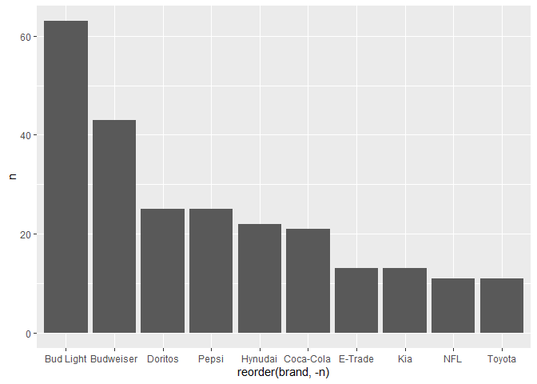
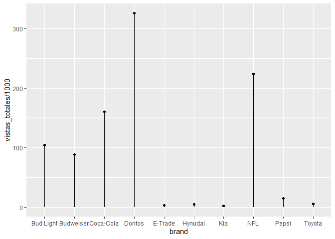

<style>
p.comment {
background-color: #DBDBDB;
padding: 10px;
border: 1px solid black;
margin-left: 25px;
border-radius: 5px;
font-style: italic;
}

.figure {
   margin-top: 20px;
   margin-bottom: 20px;
}

h1.title {
  font-weight: bold;
  font-family: Arial;  
}

h2.title {
  font-family: Arial;  
}

</style>


<style type="text/css">
#TOC {
  font-size: 13px;
  font-family: Arial;
}
</style>

\


Las tareas de este curso serán menos guiadas, pero tratarán de estimular de manera más intensa su creatividad para resolver problemas.

Por ejemplo, esta semana la idea es participar en la dinámica de *#tidytuesday* y compartir alguna visualización con la comunidad de internet. La base de esta semana (puedes ver el repositorio y el calendario [aquí](https://github.com/rfordatascience/tidytuesday/blob/master/data/2021/2021-03-02/readme.md)) se trata de los anuncios del Super Tazón. 

Utiliza las bibliotecas que vimos en clase para hacer una visualición como más te guste.


1. Carga las bibliotecas.

2. Carga los datos y exploralos con `glimpse`.


```r
youtube <- readr::read_csv('https://raw.githubusercontent.com/rfordatascience/tidytuesday/master/data/2021/2021-03-02/youtube.csv')
```

```
## 
## -- Column specification ------------------------------------------------
## cols(
##   .default = col_character(),
##   year = col_double(),
##   funny = col_logical(),
##   show_product_quickly = col_logical(),
##   patriotic = col_logical(),
##   celebrity = col_logical(),
##   danger = col_logical(),
##   animals = col_logical(),
##   use_sex = col_logical(),
##   view_count = col_double(),
##   like_count = col_double(),
##   dislike_count = col_double(),
##   favorite_count = col_double(),
##   comment_count = col_double(),
##   published_at = col_datetime(format = ""),
##   category_id = col_double()
## )
## i Use `spec()` for the full column specifications.
```


¿Qué observas de la base?, ¿qué datos te podrían servir para graficar algo?

Hay un grupo de variables dicotómicas que permite observar el principal característica de cada comercial, ¿cómo podrías usarlo?

3. Planea tu gráfica. En una hoja de papel o lienzo de paint dibuja cómo imaginas tu gráfica.

Algunas ideas:

- ¿Cuál es la empresa que más comerciales ha tenido para el medio tiempo del Súper Bowl?


```r
conteo_marca <- youtube %>% 
  count(brand) %>% 
  arrange(-n)


ggplot(conteo_marca,
       aes(x=reorder(brand, -n), 
           y=n)) +
  geom_col()
```

<!-- -->


- ¿Qué empresa ha tenido más vistas a través de los años? 


```r
vistas <- youtube %>%
  group_by(brand) %>% 
  summarise(vistas_totales = sum(like_count, na.rm=T)) 

ggplot(vistas,
       aes(x=brand,
       y=vistas_totales/1000)
       ) +
  ggalt::geom_lollipop()
```

<!-- -->

- **¿Cuál es la empresa más odiada?** Puedes hacer una variable con `mutate` que de el total de *likes* menos *dislikes*, agrupar por marca, sumarizar  el promedio de ese número y graficarla con un `geom_col`.

- **¿El uso de sexo para vender se ha acentuado con los años?** Al ser dicotómica, la variable `use_sex` puede ser sumada como un número. Utiliza esa característica para sumar el número de comerciales que tienen como tema principal el sexo para vender agrupados por años. Grafica con una línea. 

Recuerda que puedes usar `facet_wrap()` o una animación para aprovechar la variable "year"-


4. Usa `theme()` o alguno de los temas precargados para modificar lo que no te guste y añade las `labs()` necesarias.


